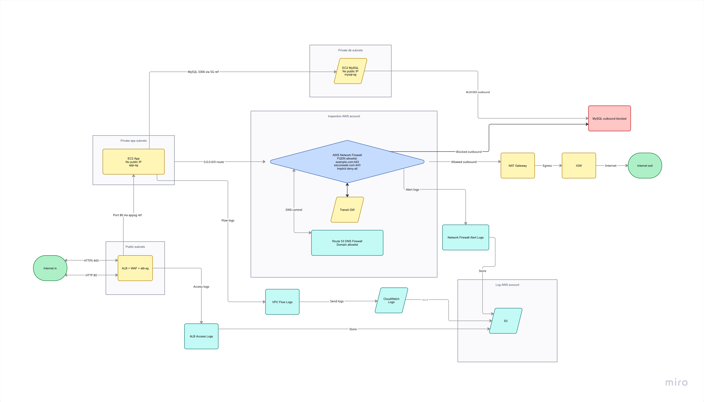

# Future State — Long-Term Target Architecture

This document describes the full production-grade architecture that the Payment
Provider should reach post-audit. The current fixed_state is a **5-day interim fix**
that satisfies PCI-DSS 1.3.1 and 1.3.2 with minimum change. Everything here is
additive — no rollback of the existing remediation is needed.

---

## Architecture



```
Internet
    ↓ HTTPS 443
   ALB (alb-sg, WAF)
    ↓ port 80 to app-sg ref
EC2 App (no public IP)
    ↓ 0.0.0.0/0 route → Firewall endpoint
AWS Network Firewall
    [FQDN allowlist: example.com:443, secureweb.com:443]
    [implicit deny-all other destinations]
    ↓ inspected traffic
NAT Gateway → IGW → Internet

EC2 App → EC2 MySQL (port 3306, SG ref)
EC2 MySQL → BLOCKED

Route 53 DNS Firewall → domain allowlist
VPC Flow Logs → CloudWatch Logs
ALB Access Logs → S3
Network Firewall Alert Logs → S3
```

---

## Implementation Phases

### Phase 1 — Done ✅

5-day interim SG remediation. See [fixed_state/README.md](fixed_state/README.md).

| Deliverable | Status |
|---|---|
| alb-sg, app-sg, mysql-sg — restricted inbound | ✅ |
| alb-sg egress port 80 to app-sg only | ✅ |
| app-sg egress port 443 to whitelist + port 3306 to mysql-sg | ✅ |
| mysql-sg egress deny-all (loopback placeholder) | ✅ |
| EC2 public IPs removed | ✅ |
| ALB port 80 → redirect to HTTPS | ✅ |
| NAT Gateway + route tables | ✅ |

### Phase 2 — Post-Audit

| Deliverable | PCI Req | Effort |
|---|---|---|
| Network Firewall — FQDN egress enforcement | 1.3.2 (upgrade) | Medium |
| NACLs — third NSC layer | Defense-in-depth | Low |
| Route 53 DNS Firewall | Defense-in-depth | Low |
| VPC Flow Logs + CloudWatch | PCI Req 10.2 | Low |
| ALB access logs | PCI Req 10.2 | Low |
| Network Firewall alert logs | PCI Req 10.2 | Low |
| WAF on ALB | Defense-in-depth | Medium |

### Phase 3 — Month 2-3

| Deliverable                                       | PCI Req | Effort |
|---------------------------------------------------|---|---|
| New custom VPC + private subnets                  | Best practice | High — requires MySQL migration |
| Separate networking AWS account + Transit Gateway | AWS SRA | High |
| Separate logging AWS account                      | AWS SRA | High 
| Multi-AZ Network Firewall (endpoint per AZ)       | HA | Medium |
| Valid ACM certificate (replace self-signed)       | PCI Req 4.2 | Low |

---

## Phase 2 Detail

### Network Firewall — FQDN Egress Enforcement

**Why:** The current `app_egress_cidrs` (static IP list) is an unstable proxy.
Domain IPs rotate — CDNs and cloud services change IPs without notice. A static CIDR
allowlist breaks silently when IPs rotate.

**What:** AWS Network Firewall with a stateful STRICT_ORDER FQDN allowlist rule group
inspects TLS SNI to enforce destination by domain name, not IP.

```
Allow: example.com:443
Allow: secureweb.com:443
Deny:  all other destinations (implicit)
```

**Upgrade path (no SG changes needed):**

1. Remove specific CIDRs from `app-sg` egress port 443 — replace with `0.0.0.0/0`
   (firewall enforces destination; SG only enforces port)
2. Add `modules/firewall/` — Network Firewall, stateful rule group, policy
   (`ASYMMETRIC_ROUTING = true`)
3. Add `/28` firewall subnet to `modules/vpc/`
4. Rewire EC2 app route table: `0.0.0.0/0` → Firewall endpoint (was → NAT GW)
5. Add firewall route table: `0.0.0.0/0` → NAT GW
6. Run `make test-firewall` to validate FQDN enforcement:

```bash
make test-firewall INSTANCE_ID=i-xxx AWS_REGION=us-east-1
# ST-NF-01: curl https://example.com    → OK
# ST-NF-02: curl https://secureweb.com  → OK
# ST-NF-03: curl https://google.com     → DROPPED
# ST-NF-04: firewall alert log entry    → DROP entry present
```

**Terraform resources:**
```hcl
aws_networkfirewall_firewall
aws_networkfirewall_firewall_policy
aws_networkfirewall_rule_group  # STATEFUL, STRICT_ORDER, TLS_SNI
```

### NACLs — Third NSC Layer

SGs satisfy PCI 1.3.1 + 1.3.2 fully. NACLs add a stateless second control layer at
the subnet boundary — provides defence-in-depth and is the first recommended post-audit
addition.

```hcl
# Public subnet NACL — ALB tier
aws_network_acl  # inbound: 443+80 allow; outbound: ephemeral allow
aws_network_acl_rule

# Private subnet NACL — app tier
aws_network_acl  # inbound: port 80 from ALB subnet only; outbound: 443+3306 allow

# Data subnet NACL — MySQL tier
aws_network_acl  # inbound: port 3306 from app subnet only; outbound: ephemeral allow
```

No data migration required — NACL changes are subnet-level attribute changes.

### Route 53 DNS Firewall

DNS-layer complement to Network Firewall. Blocks resolution of domains not on the
allowlist before a connection attempt is even made.

```hcl
aws_route53_resolver_firewall_domain_list
aws_route53_resolver_firewall_rule_group
aws_route53_resolver_firewall_rule_group_association
```

Near-zero cost, no subnet changes required.

### Logging — PCI Req 10.2

| Log type | Destination | Terraform resource |
|---|---|---|
| VPC Flow Logs | CloudWatch Logs | `aws_flow_log` |
| Network Firewall alert logs | S3 | `aws_networkfirewall_logging_configuration` |
| ALB access logs | S3 | `aws_lb` attribute `access_logs` |
| CloudWatch alarm | SNS | `aws_cloudwatch_metric_alarm` |

### WAF on ALB — PCI Req 6.4

```hcl
aws_wafv2_web_acl         # managed rule groups: AWSManagedRulesCommonRuleSet
aws_wafv2_web_acl_association
```

Attach to ALB ARN. Provides OWASP Top 10 protection, rate limiting, and IP reputation
lists.

---

## Phase 3 Detail

### New Custom VPC + Private Subnets

**Why:** The current remediation reuses the default VPC. A purpose-built VPC with
dedicated private subnets (no internet route for app + data tiers) provides stronger
isolation and is the AWS recommended baseline for PCI workloads.

**What:**
- New VPC with non-overlapping CIDR
- Private subnets for app and data tiers (no IGW route)
- Public subnet for ALB only
- VPC endpoints for AWS services (S3, CloudWatch, SSM) — no NAT GW needed for AWS API calls

**Effort:** High — requires MySQL data migration and a planned maintenance window.

### Separate Networking Account + Transit Gateway

AWS Security Reference Architecture recommends a dedicated networking account that owns
the shared network infrastructure (VPCs, Transit Gateway, Network Firewall, inspection
VPC). Application workloads run in separate accounts and connect via TGW.

**Benefits:**
- Blast radius isolation — network compromise does not reach workload accounts
- Centralised egress inspection via shared inspection VPC
- Simplified firewall management across multiple workloads

**Effort:** High — requires multi-account restructuring.

### Multi-AZ Network Firewall

The current Network Firewall plan deploys a single endpoint. Production deployments
need one endpoint per AZ for availability.

```hcl
aws_networkfirewall_firewall {
  subnet_mapping { subnet_id = aws_subnet.firewall_a.id }
  subnet_mapping { subnet_id = aws_subnet.firewall_b.id }
  subnet_mapping { subnet_id = aws_subnet.firewall_c.id }
}
```

Each AZ also needs its own route table pointing to the local firewall endpoint.

---

## Summary Table

| Item | Phase | PCI Req | Notes |
|---|---|---|---|
| SG hardening | 1 — ✅ Done | 1.3.1 + 1.3.2 | Core remediation |
| NAT Gateway | 1 — ✅ Done | Supporting | App egress path |
| Network Firewall — FQDN | 2 | 1.3.2 upgrade | Replace IP proxy with FQDN control |
| NACLs | 2 | Defence-in-depth | Third NSC layer |
| Route 53 DNS Firewall | 2 | Defence-in-depth | DNS resolution layer |
| VPC Flow Logs | 2 | PCI Req 10.2 | Audit trail |
| ALB access logs | 2 | PCI Req 10.2 | Audit trail |
| WAF | 2 | PCI Req 6.4 | App protection |
| New custom VPC | 3 | Best practice | Requires migration |
| Separate networking account + TGW | 3 | AWS SRA | Multi-account |
| Multi-AZ Firewall | 3 | HA | Production readiness |
| Valid ACM certificate | 3 | PCI Req 4.2 | Replace self-signed |
