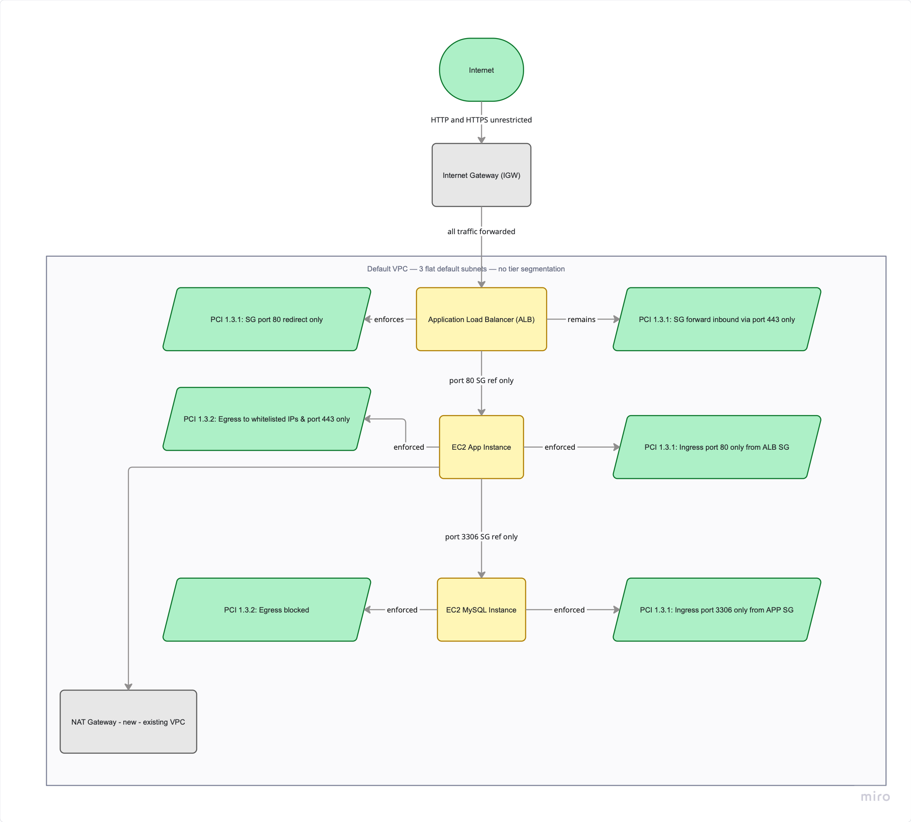

# Fixed State — PCI-DSS 1.3.1 + 1.3.2 Remediation

This directory contains a **5-module Terraform configuration** that applies the PCI
remediation in-place on the existing infrastructure. No new VPC, no new subnets, no
data migration. Resources are imported from `initial_state` and their SG rules
overwritten in a single `terraform apply`.

---

## Architecture


```
Internet
    ↓ HTTPS 443 only (0.0.0.0/0)
   ALB (alb-sg)
    ↓ port 80, to app-sg ref only
EC2 App (app-sg)
    ↓ port 3306, to mysql-sg ref only
EC2 MySQL (mysql-sg)

EC2 App outbound:
    → port 443 to app_egress_cidrs only (MiniStack)
    → Network Firewall → NAT GW (real AWS)

EC2 MySQL outbound:
    → BLOCKED (loopback placeholder)
```

---

## What Changed vs Initial State

| Component | Before | After |
|---|---|---|
| alb-sg inbound 80 | `0.0.0.0/0`, forward action | `0.0.0.0/0`, redirect to HTTPS only |
| alb-sg inbound 443 | `0.0.0.0/0` | `0.0.0.0/0` (public endpoint — unchanged) |
| alb-sg egress | allow-all | port 80 to `app-sg` ref only |
| app-sg inbound | `0.0.0.0/0` port 80 | `alb-sg` ref only |
| app-sg egress | allow-all | port 443 to `app_egress_cidrs` + port 3306 to `mysql-sg` ref |
| mysql-sg inbound | `0.0.0.0/0` port 3306 | `app-sg` ref only |
| mysql-sg egress | allow-all | `127.0.0.1/32` loopback (deny-all effective) |
| EC2 public IPs | assigned | removed (`associate_public_ip_address=false`) |
| ALB port 80 action | forward | 301 redirect to HTTPS |
| NAT Gateway | none | added — app EC2 outbound exit |
| Route table | direct IGW | app subnet → NAT GW |

---

## Module Breakdown

| Module | What it creates / manages |
|---|---|
| `modules/vpc/` | Imports VPC, subnets, IGW. Creates NAT GW + EIP + route tables. |
| `modules/security_groups/` | Imports and rewrites alb-sg, app-sg, mysql-sg. Core PCI fix. |
| `modules/compute/` | Imports EC2 app + MySQL. Removes public IPs. |
| `modules/alb/` | Imports ALB. Replaces port 80 forward listener with 301 redirect. |
| `modules/firewall/` | **Stub only** — real AWS deployment. MiniStack does not support `aws_networkfirewall_*`. |

---

## PCI-DSS 1.3.1 — Inbound Restricted ✅

### alb-sg inbound

| Port | Source | Rule | Rationale |
|---|---|---|---|
| 443 | `0.0.0.0/0` | Allow | Public HTTPS endpoint — unrestricted by design |
| 80 | `0.0.0.0/0` | Allow + redirect | TCP connection required for ALB to issue 301 redirect. Redirect fires at listener layer before any data reaches the app. Forward action is a violation — redirect is not. |

### app-sg inbound

| Port | Source | Rule | Rationale |
|---|---|---|---|
| 80 | `alb-sg` ID ref | Allow | Inbound from ALB only — no CIDR sources. Lateral movement from other VPC resources is blocked. |

### mysql-sg inbound

| Port | Source | Rule | Rationale |
|---|---|---|---|
| 3306 | `app-sg` ID ref | Allow | Inbound from app EC2 only — no CIDR sources. Direct internet or lateral access is blocked. |

---

## PCI-DSS 1.3.2 — Outbound Restricted ✅

### alb-sg egress

| Port | Destination | Rule | Rationale |
|---|---|---|---|
| 80 | `app-sg` ID ref | Allow | ALB→EC2 is ALB-initiated (not return traffic). Explicit egress required. Restricted to app targets only. |

### app-sg egress

| Port | Destination | Rule | Rationale |
|---|---|---|---|
| 443 | `app_egress_cidrs` | Allow | Internet egress restricted to known CIDRs. IP-based proxy for FQDN control in MiniStack. Upgrade to Network Firewall for real AWS. |
| 3306 | `mysql-sg` ID ref | Allow | App→MySQL path. Restricted to mysql-sg ref only — no CIDR destination. |

### mysql-sg egress

| Port | Destination | Rule | Rationale |
|---|---|---|---|
| all | `127.0.0.1/32` | Allow (loopback) | MySQL has zero outbound requirements. Desired state is deny-all. See design decision below. |

---

## Design Decisions

### alb-sg port 443: `0.0.0.0/0`

Locked as valid. The ALB is a public-facing HTTPS endpoint. Restricting to an IP
allowlist is possible (`var.allowed_ingress_ips`) but was not required for this
remediation. The variable exists and can be applied if an auditor requires it.

### alb-sg port 80: `0.0.0.0/0` with redirect

Port 80 is open from `0.0.0.0/0` so that the ALB can accept TCP connections and
issue a 301 redirect to HTTPS. The redirect fires at the listener layer before any
application traffic is processed. Port 80 with a **forward** action is a PCI 1.3.1
violation. Port 80 with a **redirect** action is acceptable — the scan marks redirect
as ✅ and forward as ❌.

### alb-sg explicit egress

The ALB initiates the connection to EC2 app — it is not return traffic from an inbound
connection. SGs are stateful only for the direction a connection is initiated. Without
an explicit egress rule, the ALB cannot forward traffic to the app targets.

### app-sg egress port 3306

App EC2 needs to reach MySQL EC2 on port 3306. The spec required restricting outbound,
not eliminating all connectivity. The rule uses a SG ID ref so only mysql-sg instances
are reachable — no IP range is opened.

### mysql-sg egress: `127.0.0.1/32` loopback

MySQL has zero outbound requirements. The desired state is deny-all egress.

**Why not simply remove all egress rules?**

AWS automatically adds a default `allow-all` egress rule (`0.0.0.0/0`) to every
new security group. The Terraform AWS provider only removes this default when it
manages at least one explicit egress block — with zero egress blocks the provider
treats egress as unmanaged and leaves the AWS default in place.

The loopback rule (`127.0.0.1/32`) forces Terraform to declare ownership of the egress
rule set, which causes the AWS default to be evicted on `terraform apply`. Loopback
(`127.0.0.1`) is unreachable from EC2 network interfaces — no real traffic can egress.
On real AWS this produces effective deny-all egress.

On MiniStack the default allow-all is re-injected regardless of config. This appears
as ⚠️ in `make scan` and is a known MiniStack fidelity gap.

### app_egress_cidrs: IP proxy for FQDN control

MiniStack does not support Network Firewall. `app_egress_cidrs` is a list of
destination CIDRs that approximate the FQDN allowlist (`example.com`, `secureweb.com`)
for local testing. On real AWS, Network Firewall with FQDN rules enforces destination
control. IPs used are illustrative placeholders — domain IPs rotate in production.

---

## Expected MiniStack Warnings

The following `⚠️` results in `make scan` are expected MiniStack fidelity gaps, not
configuration defects. They will resolve on real AWS:

| Warning | Root cause |
|---|---|
| `mysql-sg egress — allow-all present` | MiniStack injects default allow-all egress regardless of config |
| `alb-sg egress — allow-all present` | Same MiniStack limitation |
| `EC2 → default SG present` | MiniStack assigns default SG at launch; `null_resource` workaround attaches correct SG but MiniStack may not remove default |

---

## How to Deploy

```bash
# MiniStack must be running with initial_state deployed
make import-fixed   # resolve IDs, write tfvars, import into TF state
make fixed          # apply PCI fixes
make validate-fixed # confirm all resources exist
make scan           # confirm compliance (⚠️ MiniStack gaps expected)
```

---

## Variables

| Variable | Default | Description |
|---|---|---|
| `app_egress_cidrs` | `["93.184.216.34/32", "203.0.113.10/32"]` | App EC2 internet egress destinations (port 443). IP proxy for FQDN control. |
| `allowed_ingress_ips` | `["10.0.0.0/8"]` | Reserved — future IP allowlist for alb-sg if auditor requires tightening. |
| `vpc_id` | auto-populated by `import_fixed.sh` | VPC ID from initial_state |
| `subnet_ids` | auto-populated by `import_fixed.sh` | 3 subnet IDs |
| `alb_sg_description` | auto-populated | Exact description — prevents Terraform forced replacement |
| `app_sg_description` | auto-populated | Same |
| `mysql_sg_description` | auto-populated | Same |
| `acm_certificate_arn` | auto-populated | ACM cert ARN for HTTPS listener |

---

## Further Reading

- [Future State](../FUTURE_STATE.md) — Network Firewall, NACLs, WAF, new VPC
- [Root README](../README.md) — full workflow and make targets
