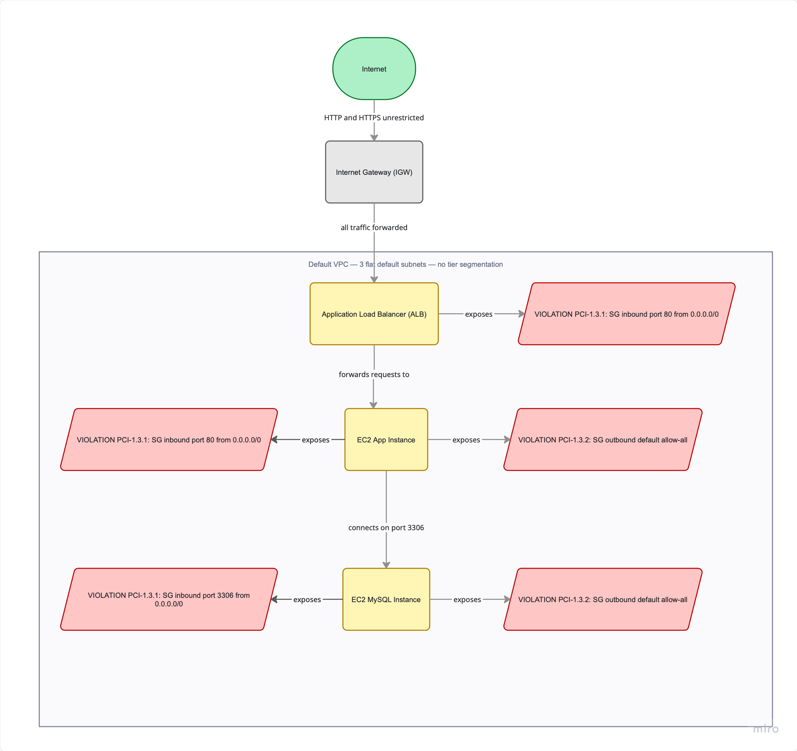

# Initial State — Pre-Remediation Baseline

This directory contains a **flat Terraform configuration** that deploys the
pre-remediation infrastructure. It intentionally introduces PCI-DSS 1.3.1 and 1.3.2
violations to serve as a documented baseline before the fix is applied.

> **Do not use this as a template.** Every violation is deliberate.

---

## Architecture



---

## Resources Created

| Resource | Name | Notes |
|---|---|---|
| VPC | `default-vpc-simulated` | 172.31.0.0/16 |
| Subnets | `subnet-a/b/c-initial` | 3 AZs, `map_public_ip_on_launch=true` |
| Internet Gateway | `igw-initial` | Attached to VPC |
| Route Table | `rt-initial` | 0.0.0.0/0 → IGW |
| Security Group | `alb-sg` | See violations below |
| Security Group | `app-sg` | See violations below |
| Security Group | `mysql-sg` | See violations below |
| EC2 Instance | `app-instance-initial` | t3.micro, public IP |
| EC2 Instance | `mysql-instance-initial` | t3.micro, public IP |
| ALB | `alb-initial` | Internet-facing |
| ALB Listener | port 80 | **Forward** action — violation |
| ALB Listener | port 443 | HTTPS, self-signed cert |
| Target Group | `app-tg-initial` | Port 80 → EC2 app |
| ACM Certificate | `poc-cert-initial` | Self-signed via `tls_self_signed_cert` |

---

## PCI-DSS 1.3.1 Violations — Inbound Not Restricted

PCI-DSS 1.3.1 requires inbound traffic to the CDE be restricted to only necessary
traffic. All other traffic must be specifically denied.

### alb-sg

| Port | Source | Violation |
|---|---|---|
| 80 | `0.0.0.0/0` | Any IP reaches ALB port 80 — listener forwards directly to app (no redirect) |
| 443 | `0.0.0.0/0` | Any IP reaches ALB port 443 — no IP restriction |

### app-sg

| Port | Source | Violation |
|---|---|---|
| 80 | `0.0.0.0/0` | Any IP reaches app EC2 directly — bypasses ALB entirely |

### mysql-sg

| Port | Source | Violation |
|---|---|---|
| 3306 | `0.0.0.0/0` | Any IP reaches MySQL directly — no restriction to app tier |

---

## PCI-DSS 1.3.2 Violations — Outbound Not Restricted

PCI-DSS 1.3.2 requires outbound traffic from the CDE be restricted to only necessary
traffic. All other traffic must be specifically denied.

| Security Group | Egress Rule | Violation |
|---|---|---|
| `alb-sg` | allow-all `0.0.0.0/0` | ALB can reach any destination on any port |
| `app-sg` | allow-all `0.0.0.0/0` | App EC2 can exfiltrate to any destination |
| `mysql-sg` | allow-all `0.0.0.0/0` | MySQL can initiate outbound to any destination |

---

## Additional Violations

| Violation | Check ID | Description |
|---|---|---|
| EC2 public IPs | CKV_AWS_88 | Both instances have public IPs — direct internet exposure |
| Subnet auto-assign | CKV_AWS_130 | All subnets have `map_public_ip_on_launch=true` |
| Port 80 forward | CKV_AWS_92 | ALB port 80 forwards to app instead of redirecting to HTTPS |

---

## MiniStack Limitation — SG Attachment

MiniStack assigns the default SG (`sg-00000001`) to every new instance regardless of
`vpc_security_group_ids`. The initial state works around this with a `null_resource`
that calls `awslocal ec2 modify-network-interface-attribute --groups` post-launch to
explicitly attach the correct (violating) SG and detach the default.

The default SG is also neutralised with `ingress=[] egress=[]` so that even if
MiniStack attaches it, it contributes no open rules to the combined policy.

On real AWS, `vpc_security_group_ids` is fully honoured at launch and no workaround
is needed.

---

## Expected `make scan` Output

```
── PCI 1.3.1 — Inbound Restricted ─────────────────────────
  ❌  alb-sg port 80 from 0.0.0.0/0 — action=forward (exposes data path)
  ❌  app-sg inbound port 80 — open to 0.0.0.0/0
  ❌  mysql-sg inbound port 3306 — open to 0.0.0.0/0

── PCI 1.3.2 — Outbound Restricted ─────────────────────────
  ❌  alb-sg egress port 80 — rule missing
  ❌  app-sg egress: MISSING: egress port 443 to known CIDRs
  ❌  mysql-sg egress — loopback placeholder missing
```

---

## How to Deploy

```bash
make up              # start MiniStack
make initial         # deploy initial state
make validate-initial  # confirm resources exist
make scan            # confirm violations are present
```

## Next Step

```bash
make import-fixed && make fixed && make scan
```

See [fixed_state/README.md](../fixed_state/README.md).
